# Smart Student Information System

### Aditya University

[](#university)
[](#author)
[](https://spring.io/projects/spring-boot)
[](https://react.dev)
[](https://vitejs.dev)
[](https://www.mysql.com/)

A professional university information management system developed for **Aditya University** by **Vijay** to manage academic, student, faculty, attendance, events, certificates, and related institutional activities through a centralised web application.

---

## Overview

The Smart Student Information System is a web-based management application developed for Aditya University. The system simplifies day-to-day academic operations by connecting students, faculty members, and college administrators into a single portal. 

It provides structured record management for academic programmes, student profiles, faculty teaching assignments, class timetables, daily attendance tracking, examination marks, university events, and student certificates. The platform reduces manual paperwork and improves accessibility of academic data across university departments.

---

## Objectives

- Centralise student information and academic records in a secure database.
- Manage student enrollment, departmental allocations, and faculty assignments.
- Maintain accurate class attendance records with percentage tracking.
- Organise university events, student registrations, and coordinator assignments.
- Issue and manage authentic student achievement and participation certificates.
- Provide secure role-based access control for students, faculty, and administrators.
- Improve communication of circulars, announcements, and examination results.
- Provide a clean, structured university management interface for academic workflows.

---

## Key Features

- **Role-Based Access**: Dedicated portals for Administrators, Faculty, and Students with tailored permissions.
- **Student Profile Management**: Complete student records including roll numbers, departments, semesters, sections, and contact details.
- **Faculty Directory**: Faculty profiles with designations, departments, assigned subjects, and teaching schedules.
- **Department & Course Management**: Structure for university engineering departments (CSE, AIML, ECE, EEE, MECH) and course curricula.
- **Timetable Scheduling**: Weekly class schedule matrix mapping subjects, faculty, classrooms, and daily periods.
- **Class Attendance System**: Faculty attendance marking with automated percentage calculations and attendance shortage warnings (<75%).
- **Marks & Examination System**: Faculty marks entry for internal assessments and semester evaluations with student scorecards.
- **Event Management**: University events publishing, student registrations, and coordinator management.
- **Certificate Issuance**: Digital certificate generation for event winners and participants with verifiable certificate numbers.
- **Announcements**: Campus-wide notices and departmental circulars.

---

## User Roles

### Admin
The Administrator manages institutional configurations and university records:
- Manage student profiles, registrations, and course enrollments.
- Manage faculty onboarding, department allocations, and designations.
- Configure departments, degree programmes, semesters, and subjects.
- Set up and publish weekly academic timetables.
- Monitor university-wide attendance statistics and review attendance shortage reports.
- Review and approve official attendance adjustments with audit reasons.
- Create university events and assign faculty coordinators.
- Configure certificate templates and oversee certificate issuance.

### Faculty
Faculty members manage academic activities for their assigned classes:
- View assigned teaching subjects, timetable periods, and student rosters.
- Take daily attendance for scheduled lecture classes by section and subject.
- Mark student attendance status (Present, Absent, Late, Excused) and save records.
- View subject-wise attendance analytics, class averages, and student attendance counts.
- Upload and manage student marks for internal tests, assignments, and semester examinations.
- Coordinate assigned university events, review participant lists, and submit event results.
- Trigger certificate generation for eligible student event participants.

### Student
Students access their individual academic records and campus activities:
- View student profile information, enrolled course, current semester, and section.
- View real-time attendance overview, subject-wise attendance percentages, and shortage indicators.
- View date-wise attendance history with date filters.
- View weekly academic class timetable with room allocations and subject faculty.
- View examination results, internal assessment scores, and subject marks.
- Browse campus events, read guidelines, and submit event registrations.
- View and download issued achievement and participation certificates from the My Certificates section.

---

## Main Modules

| Module | Description | Access Level |
| :--- | :--- | :--- |
| **Authentication** | Secure login, session validation, and password management | All Users |
| **Student Management** | Student admissions, profiles, roll numbers, and semester allocations | Admin |
| **Faculty Management** | Faculty profiles, designations, department tags, and contact details | Admin |
| **Academic Management** | Department setups, degree courses, curriculum subjects, and credits | Admin |
| **Timetable Module** | Weekly period scheduling (Periods 1 to 6), day mapping, and classrooms | Admin, Faculty, Student |
| **Attendance Management** | Daily class attendance marking, subject percentages, and shortage reports | Admin, Faculty, Student |
| **Marks & Grades** | Internal assessments, examination grade entry, and student marksheets | Admin, Faculty, Student |
| **Event Management** | Campus fests, technical events, registrations, and coordinator assignments | Admin, Faculty, Student |
| **Certificate Management** | Digital certificate generation, student certificate repository, and validation | Admin, Faculty, Student |
| **Announcements** | Departmental circulars, general notices, and campus updates | Admin, Faculty, Student |

---

## Event Management

The Event Management module coordinates co-curricular activities, technical symposiums, and cultural events:

1. **Admin Workflow**:
   - Create an event with title, description, category (Technical, Cultural, Sports, Workshop), date, time, and venue.
   - Set maximum participant limits and registration deadlines.
   - Assign faculty members as event coordinators.

2. **Faculty Coordinator Workflow**:
   - Access assigned events from the Faculty portal.
   - Review registered student participants.
   - Evaluate event submissions and declare results (Winner, Runner-up, Participant, or No Certificate).
   - Authorise certificate generation based on declared results.

3. **Student Workflow**:
   - Browse upcoming university events on the student dashboard.
   - Review event details, rules, and schedules.
   - Register for events with single-click verification.
   - View event results once announced.

---

## Certificate Management

The Certificate module provides structured digital certificate issuance for event achievements:

- **Template Design**: Administrators set up standardized certificate formats including institution header, signatory designations, borders, and event titles.
- **Result-Linked Generation**: Faculty coordinators select student outcomes for an event:
  - Winner
  - Runner-up
  - Participant
  - No Certificate
- **Issuance**: Once results are saved, certificates are generated with a unique Certificate Identification Number.
- **Student Access**: Issued certificates appear directly in the student's **My Certificates** tab.
- **View & Download**: Students can preview their certificate in high resolution and download a PDF copy.
- **Verification**: Each certificate includes a verifiable Certificate ID and verification link to validate authenticity.

---

## Attendance Management

The Attendance module tracks lecture attendance in accordance with university academic regulations:

- **Faculty Attendance Marking**:
  - Faculty selects the scheduled class from the daily timetable or selects the Department, Course, Section, and Subject.
  - The system loads the enrolled student roster for that section.
  - Faculty marks each student's status: **Present**, **Absent**, **Late**, or **Excused**.
  - Faculty submits the attendance sheet to update the central database.

- **Student Attendance Tracking**:
  - **Overview**: Displays total classes conducted, total classes attended, and aggregate attendance percentage.
  - **Subject-Wise Attendance**: Detailed breakdown of every enrolled subject showing attended vs total lectures and percentage.
  - **Attendance Shortage Alert**: Automatically highlights subjects where attendance falls below the mandatory 75% threshold.
  - **Date-Wise History**: Displays historical attendance records with date-range filtering.

- **Administrative Oversight**:
  - Administrators view college-wide attendance summaries.
  - Generate shortage lists for students below 75% attendance for institutional review.
  - Perform authorized attendance adjustments (e.g. for official On-Duty leave or medical leave) with mandatory remarks.

---

## System Architecture

The Smart Student Information System follows a modern enterprise three-tier distributed architecture engineered for high availability, modularity, data integrity, and strict role-based access control across Aditya University.

```mermaid
graph TD
    %% User Roles & Client Tier
    subgraph ClientTier ["1. Presentation Tier (React 18 + Vite)"]
        direction TB
        subgraph UsersGroup ["Institutional Stakeholders"]
            U1["🎓 Student Portal"]
            U2["👨‍🏫 Faculty Portal"]
            U3["🛡️ Admin Console"]
            U4["🌐 Public Certificate Verifier"]
        end
        subgraph FrontendCore ["Frontend Core Architecture"]
            UI["Responsive UI (Tailwind CSS + Lucide Icons)"]
            ROUTER["Client-Side Routing (React Router v6)"]
            STATE["Global Contexts (AuthContext, ThemeContext)"]
            CLIENT["HTTP Layer (Axios Interceptors + Bearer JWT)"]
            VIZ["Data Analytics (Recharts) & Client PDF Canvas"]
        end
        UsersGroup --> UI
        UI --> ROUTER
        ROUTER --> STATE
        STATE --> CLIENT
        UI --> VIZ
    end

    %% Network Connection
    CLIENT ==>|"RESTful HTTP / JSON (CORS + JWT)"| SEC_GATEWAY

    %% Backend Tier
    subgraph ServerTier ["2. Application Tier (Spring Boot 3.2.0 + Java 17)"]
        direction TB
        
        subgraph SecurityLayer ["Security and Authorization Filter Chain"]
            SEC_GATEWAY["Spring Security 6 SecurityFilterChain"]
            JWT_FILTER["JwtAuthFilter (Token Parsing and Claims Extraction)"]
            RBAC["Role-Based Access Control (ADMIN, FACULTY, STUDENT)"]
            SEC_GATEWAY --> JWT_FILTER
            JWT_FILTER --> RBAC
        end

        subgraph ControllerLayer ["API Controller Layer (REST Endpoints)"]
            C_AUTH["AuthController (/api/auth)"]
            C_ADMIN["AdminController (/api/admin)"]
            C_FACULTY["FacultyController (/api/faculty)"]
            C_STUDENT["StudentController (/api/student)"]
            C_ATT["AttendanceController (/api/attendance)"]
            C_EVENT["EventController (/api/events)"]
            C_CERT["CertificateController (/api/certificates)"]
            C_PUB["PublicVerifyController (/api/public/verify)"]
        end

        RBAC --> ControllerLayer

        subgraph ServiceLayer ["Service Tier (Business Logic and Workflows)"]
            S_AUTH["AuthService (Authentication & Password Security)"]
            S_ADMIN["AdminService (Departments, Courses, Accounts)"]
            S_ATT["AttendanceService (Roster Attendance & 75% Shortage Engine)"]
            S_TIMETABLE["TimetableService (4-Way Matrix Conflict Detector)"]
            S_EVENT["EventService (Registrations, Results, Coordinators)"]
            S_CERT["CertificateService (UUID Issuance & OpenPDF Rendering)"]
            S_AUDIT["AuditLogService (System Activity Tracking)"]
        end

        ControllerLayer --> ServiceLayer

        subgraph DataAccessLayer ["Persistence Layer (Spring Data JPA & Hibernate ORM)"]
            R_USER["UserRepository"]
            R_COURSE["CourseRepository & DepartmentRepository"]
            R_ATT["AttendanceRepository"]
            R_TIME["TimetableRepository"]
            R_EVENT["EventRepository & ParticipantRepository"]
            R_CERT["CertificateRepository & TemplateRepository"]
            R_AUDIT["AuditLogRepository"]
        end

        ServiceLayer --> DataAccessLayer
    end

    %% Database Connection
    DataAccessLayer ==>|"HikariCP Connection Pool (SQL Transactions)"| DB_TIER

    %% Database Tier
    subgraph DB_TIER ["3. Database Tier (MySQL 8.0 Relational Engine)"]
        direction TB
        DB_TABLES[("MySQL Relational Schema
        ────────────────────────────────────────────────
        • users (Admin, Faculty, Student records)
        • departments, courses, and subjects
        • timetables (Classroom and period schedule)
        • attendance (Daily class-wise roster marks)
        • events, event_coordinators, and participants
        • certificate_templates and certificates
        • activity_logs (Administrative audit records)")]
    end

    %% Styling
    classDef clientStyle fill:#eff6ff,stroke:#3b82f6,stroke-width:2px,color:#1e3a8a
    classDef securityStyle fill:#fef2f2,stroke:#ef4444,stroke-width:2px,color:#991b1b
    classDef controllerStyle fill:#f0fdf4,stroke:#22c55e,stroke-width:2px,color:#166534
    classDef serviceStyle fill:#fefce8,stroke:#eab308,stroke-width:2px,color:#854d0e
    classDef dbStyle fill:#faf5ff,stroke:#a855f7,stroke-width:2px,color:#6b21a8

    class ClientTier,UsersGroup,FrontendCore clientStyle
    class SecurityLayer securityStyle
    class ControllerLayer,DataAccessLayer controllerStyle
    class ServiceLayer serviceStyle
    class DB_TIER dbStyle
```



### Architectural Tier Breakdown

| Layer | Component | Key Responsibilities |
|---|---|---|
| **Presentation Tier** | React 18, Vite, Tailwind CSS | Single Page Application (SPA), role-based dynamic dashboard routing, responsive Indian institution UI layout, Recharts analytics, client-side PDF preview canvas. |
| **API & Security Gateway** | Spring Security 6, JWT Filter | Stateless token authentication, cryptographic HMAC signature verification, CORS validation, endpoint role filters (`hasRole('ADMIN')`, etc.). |
| **REST Controller Layer** | Spring Web MVC | Request validation (`@Valid`), HTTP status code handling, DTO mapping, and REST endpoint exposure. |
| **Business Service Layer** | Core Spring Services | Business logic execution, 4-way timetable collision prevention, roster attendance percentage calculations, certificate generation engine, and audit logging. |
| **Persistence Layer** | Spring Data JPA, Hibernate 6 | Relational-to-object mapping, transactional integrity (`@Transactional`), automated schema maintenance, and optimized queries. |
| **Database Tier** | MySQL 8.0, HikariCP | ACID-compliant relational data storage, foreign key constraints, indexing for fast student roll lookups, and connection pooling. |

---

## Technology Stack

### Frontend
- **Framework**: React 18
- **Build Tool**: Vite
- **Language**: JavaScript (ES6+)
- **Styling**: Tailwind CSS & Custom CSS
- **Routing**: React Router DOM (v6)
- **Icons**: Lucide React
- **Data Visualization**: Recharts
- **HTTP Client**: Axios
- **Document Utilities**: jsPDF, html2canvas

### Backend
- **Framework**: Spring Boot 3.2.0
- **Language**: Java 17
- **Security**: Spring Security 6
- **Authentication**: Stateless JSON Web Tokens (JWT)
- **Data Access**: Spring Data JPA, Hibernate ORM
- **PDF Generation**: OpenPDF
- **API Documentation**: Springdoc OpenAPI / Swagger UI
- **Build Tool**: Apache Maven (`mvnw`)

### Database
- **Database Engine**: MySQL 8.0
- **Connection Pool**: HikariCP

---

## Project Structure

```text
Smart-Student-Information-System/
├── backend/
│   ├── .mvn/wrapper/                  # Maven wrapper files
│   ├── mvnw                           # Maven wrapper script (Linux/macOS)
│   ├── mvnw.cmd                       # Maven wrapper script (Windows)
│   ├── pom.xml                        # Maven project configuration & dependencies
│   ├── Dockerfile                     # Multi-stage production Docker build
│   └── src/
│       └── main/
│           ├── java/com/sms/
│           │   ├── config/            # Security, CORS, and Data Initializers
│           │   ├── controller/        # REST Controllers (Auth, Admin, Faculty, Student, Event, Certificate)
│           │   ├── dto/               # Request and Response Data Transfer Objects
│           │   ├── entity/            # JPA Domain Entities
│           │   ├── exception/         # Exception handlers
│           │   ├── repository/        # Spring Data JPA Repositories
│           │   ├── security/          # JWT Filters and UserDetailsService
│           │   └── service/           # Service Interfaces and Business Logic Implementations
│           └── resources/
│               └── application.properties # Server and Database Configuration
├── frontend/
│   ├── public/                        # Static assets, institutional logos, and icons
│   ├── src/
│   │   ├── components/
│   │   │   ├── attendance/            # Student, Faculty, and Admin attendance components
│   │   │   ├── certificates/          # Certificate preview components
│   │   │   ├── common/                # Layout, Header, Sidebar, and Logo
│   │   │   └── timetable/             # Timetable schedule grid
│   │   ├── context/                   # AuthContext state management
│   │   ├── pages/
│   │   │   ├── AdminDashboard.jsx     # Administrator portal
│   │   │   ├── FacultyDashboard.jsx   # Faculty portal
│   │   │   ├── StudentDashboard.jsx   # Student portal
│   │   │   ├── LoginPage.jsx          # Login view
│   │   │   ├── CertificateVerificationPage.jsx # Certificate verification view
│   │   │   └── admin/                 # Admin event and certificate sub-pages
│   │   ├── services/
│   │   │   └── api.js                 # Axios API service configuration
│   │   ├── utils/                     # PDF generation and validation helpers
│   │   ├── App.jsx                    # Application root and route definitions
│   │   ├── index.css                  # Global styles
│   │   └── main.jsx                   # React application entry point
│   ├── package.json                   # Frontend dependencies and scripts
│   ├── tailwind.config.js             # Tailwind CSS configuration
│   ├── vite.config.js                 # Vite dev server and proxy setup
│   ├── Dockerfile                     # Multi-stage production Nginx container build
│   └── nginx.conf                     # Nginx SPA routing & API reverse proxy
├── docker-compose.yml                 # One-command containerized production orchestration
├── .env.example                       # Production environment configuration template
├── .gitignore                         # Git exclusion rules
└── README.md                          # Project documentation
```

---

## Installation and Setup

### Prerequisites
- **Java**: JDK 17 or higher
- **Node.js**: v18.x or higher (with npm)
- **MySQL**: Version 8.0 or higher
- **Git**: Installed on your operating system

---

## Database Configuration

1. Start your local MySQL service.
2. Open your MySQL client and create the project database:
   ```sql
   CREATE DATABASE student_information_system;
   ```
3. Open `backend/src/main/resources/application.properties` and verify your database credentials:
   ```properties
   spring.datasource.url=jdbc:mysql://localhost:3306/student_information_system?useSSL=false&serverTimezone=Asia/Kolkata&allowPublicKeyRetrieval=true&createDatabaseIfNotExist=true
   spring.datasource.username=root
   spring.datasource.password=root
   ```

---

## Running the Application

### 1. Run the Backend Server
Open a terminal in the project root:

**Windows (PowerShell):**
```powershell
cd backend
.\mvnw.cmd spring-boot:run
```

**Linux / macOS:**
```bash
cd backend
chmod +x mvnw
./mvnw spring-boot:run
```

The Spring Boot backend will start at: `http://localhost:8080`

### 2. Run the Frontend Application
Open a second terminal window:

```powershell
cd frontend
npm install
npm run dev
```

The React frontend development server will start at: `http://localhost:5173` (or `http://localhost:5174`)

---

## Production Deployment Guide

The Smart Student Information System provides full production containerization and standalone deployment support.

### Option 1: Docker Container Deployment (Recommended)

Ensure Docker and Docker Compose are installed on your server, then launch the full multi-tier stack with:

```bash
docker compose up --build -d
```

This single command automatically:
1. Provisions a dedicated **MySQL 8.0** container with persistent storage volumes and healthchecks.
2. Builds and starts the **Spring Boot backend** container running on lightweight Eclipse Temurin JDK 17 Alpine.
3. Builds and serves the **React + Vite frontend** bundle using high-performance Nginx Alpine with built-in API reverse proxying.

Access the services:
- **Web Application Portal**: `http://localhost` (or your production server domain on port 80)
- **Backend REST API**: `http://localhost:8080/api`
- **Swagger Documentation**: `http://localhost:8080/swagger-ui.html`

To inspect running containers or stop the application:
```bash
docker compose ps
docker compose down
```

---

### Option 2: Standalone Production Deployment

#### Step 1: Package & Run Spring Boot Backend
```bash
cd backend
./mvnw clean package -DskipTests
java -jar target/student-management-system-1.0.0.jar --server.port=8080
```

#### Step 2: Build & Host React Frontend
```bash
cd frontend
npm ci
npm run build
# The production-optimized bundle is generated in the frontend/dist directory
# Serve via Nginx, Apache HTTP Server, or Cloudflare Pages
```

---

## API Overview

Interactive Swagger documentation is available when the backend server is running:
- **Swagger UI**: `http://localhost:8080/swagger-ui.html`

### Key Endpoints

| Method | Endpoint | Description | Role |
| :--- | :--- | :--- | :--- |
| `POST` | `/api/auth/login` | Authenticate user and issue JWT | Public |
| `GET` | `/api/student/profile` | Get logged-in student profile | Student |
| `GET` | `/api/student/attendance/subject-wise` | View subject attendance percentages | Student |
| `GET` | `/api/student/attendance/date-wise` | View date-wise attendance records | Student |
| `GET` | `/api/student/timetable` | View student weekly timetable | Student |
| `GET` | `/api/student/marks` | View examination marks and grades | Student |
| `GET` | `/api/faculty/attendance/today-classes` | View today's scheduled classes | Faculty |
| `POST` | `/api/faculty/attendance/session/{id}/manual` | Submit class attendance roster | Faculty |
| `GET` | `/api/faculty/attendance/subject-summary` | View subject attendance averages | Faculty |
| `POST` | `/api/faculty/marks` | Upload student examination marks | Faculty |
| `GET` | `/api/admin/dashboard` | Get university dashboard statistics | Admin |
| `GET` | `/api/admin/students` | Get all student profiles | Admin |
| `POST` | `/api/admin/students` | Register new student profile | Admin |
| `GET` | `/api/admin/faculty` | Get all faculty records | Admin |
| `POST` | `/api/admin/faculty` | Add new faculty profile | Admin |
| `GET` | `/api/admin/attendance/overview` | Institutional attendance overview | Admin |
| `GET` | `/api/admin/attendance/shortage-report` | Attendance shortage report (<75%) | Admin |
| `POST` | `/api/admin/attendance/{id}/correct` | Record attendance adjustment | Admin |
| `GET` | `/api/events` | List all university events | Authenticated |
| `POST` | `/api/events/{id}/register` | Register student for event | Student |
| `GET` | `/api/certificates/my` | View student issued certificates | Student |
| `GET` | `/api/public/verify/{certificateNumber}` | Verify certificate authenticity | Public |

---

## Security

- **Authentication**: Stateless JSON Web Token (JWT) issued upon successful login and validated on every request.
- **Password Protection**: Passwords hashed using BCrypt before storing in the database.
- **Authorization**: Role-based access control protecting administrative, faculty, and student endpoints.
- **Data Protection**: CORS policy restricts API access to authorized frontend origins.
- **Audit Trails**: Critical administrative adjustments record the action and reason.

---

## Responsive Design

The frontend user interface is built using responsive layouts:
- Optimized for desktop monitors, laptops, tablets, and mobile devices.
- Collapsible navigation sidebar and adaptive data tables for mobile screens.
- Clean typography and standardized color hierarchy suited for educational institutional portals.

---

## Future Enhancements

- **SMS & Email Alerts**: Automated notifications to students and parents when attendance drops below 75%.
- **Hostel & Transport Modules**: Facility management for student hostel allocations and bus route tracking.
- **Fee Payment Gateway**: Online tuition and examination fee payments with digital receipts.
- **Student Feedback System**: End-of-semester faculty and course feedback collection.

---

## Author

- **Developer**: Vijay
- **Project**: Smart Student Information System

---

## University

- **Institution**: Aditya University
