# 🎓 Smart Student Information System

<p align="center">
  
  
  
  
  
</p>

<p align="center">
  <strong>A professional university management platform for Students, Faculty and Administration.</strong>
</p>

<p align="center">
  <a href="https://github.com/anjiduda77-afk/Student-Information-Management">
    View Repository
  </a>
</p>

---

## 📌 Project Overview

**Smart Student Information System (SIS)** is a web-based university information management application developed for **Aditya University** by **Vijay**.

The system provides a centralised platform for managing student information, faculty activities, academic records, attendance, marks, timetable, events, registrations, certificates, and institutional operations.

The application follows a **role-based access model (RBAC)**, providing distinct interfaces and functionality for:

- 👨‍💼 **Admin** (Institutional Administration)
- 👨‍🏫 **Faculty** (Teaching, Grading, Attendance & Event Coordination)
- 🎓 **Student** (Academics, Attendance Records, Marks & Certificates)
- 🌐 **Public** (Read-only Instant Certificate Verification)

The main objective is to provide a structured, secure, and user-friendly platform for university administration and academic activities.

---

## 🎯 Objectives

The major objectives of the Smart Student Information System are:

- Centralise student and faculty information in a secure, unified database.
- Manage academic programs, departments, courses, and syllabus allocations.
- Provide secure role-based access to students, faculty, and administrative staff.
- Maintain accurate, session-wise student attendance records with percentage tracking.
- Manage internal assessment marks, semester grades, and academic performance.
- Provide weekly class schedules and timetable management.
- Manage university events, student registrations, and coordinator assignments.
- Issue authentic digital merit and participation certificates with unique IDs.
- Enable instant public verification of university-issued certificates.
- Eliminate manual paperwork and reduce operational overhead.
- Provide a responsive, high-performance web portal for academic workflows.

---

## ✨ Key Features

### 🔐 Authentication & Role-Based Access

- Secure stateless authentication using JSON Web Tokens (JWT) and BCrypt password encryption.
- Role-based access control protecting administrative, faculty, and student endpoints.
- Protected application routes with client-side and server-side authorization guards.
- Dedicated dashboards tailored to user privileges.

### 👨‍💼 Admin Management

The Admin module provides institution-level management capabilities:

- **Student Management**: Add, update, view, and manage student enrollments across departments.
- **Faculty Management**: Faculty onboarding, department assignment, and teaching designations.
- **Academic Management**: Department structures (CSE, AIML, ECE, EEE, MECH) and course curricula.
- **Attendance Monitoring**: University-wide attendance tracking and shortage reports (<75%).
- **Marks & Examination**: Centralised marks review, grading scales, and report generation.
- **Timetable Scheduling**: Room allocation, period scheduling, and weekly matrix management.
- **Event Management**: Event creation, poster uploads, rules, eligibility, and faculty coordinator assignment.
- **Certificate Templates**: Dynamic certificate template designer with customizable badges and signatures.
- **Announcements**: Campus-wide notices and departmental circulars.
- **Reports & System Settings**: System parameters, institution branding, and audit logging.

### 👨‍🏫 Faculty Management

Faculty members can access academic and event operations assigned to them:

- **Faculty Profile**: Personal details, department, and teaching assignments.
- **Assigned Subjects**: Overview of courses handled across semesters and sections.
- **Timetable**: Personal weekly teaching schedule.
- **Attendance Management**: Class roster attendance marking with present/absent toggling.
- **Marks & Grades**: Internal assessment and semester marks entry with instant GPA calculation.
- **Assigned Events**: Event coordinator workspace to manage registrations, verify attendees, record winners, and issue certificates.

### 🎓 Student Portal

Students can access their academic records and university activities:

- **Student Dashboard**: Real-time summary of attendance percentage, upcoming classes, and notices.
- **Attendance Records**: Subject-wise and date-wise attendance logs with shortage alerts (<75%).
- **Examination Marks**: Semester grade reports and subject score breakdowns.
- **Class Timetable**: Dynamic daily and weekly class schedules.
- **University Events**: Event exploration, one-click event registrations, and event details.
- **My Certificates**: View, verify, and download high-resolution PDF achievement and participation certificates.

---

## 🧩 Main Modules

| Module | Description | Access |
| :--- | :--- | :--- |
| 🔐 **Authentication** | Secure login, JWT issuance, password hashing, and session management | All Users |
| 👨‍🎓 **Student Management** | Complete student profiles, roll numbers, sections, and contact records | Admin |
| 👨‍🏫 **Faculty Management** | Faculty directory, teaching designations, and departmental allocations | Admin |
| 📚 **Academic Management** | Department management, course curricula, and semester subject mapping | Admin |
| 📝 **Attendance Tracking** | Session-wise attendance recording, percentages, and shortage identification | Admin, Faculty, Student |
| 📊 **Marks & Grades** | Examination marks entry, grade cards, and academic evaluations | Admin, Faculty, Student |
| 🗓️ **Timetable** | Daily schedule matrix mapping subjects, faculty, classrooms, and periods | Admin, Faculty, Student |
| 🎉 **Event Management** | Event publication, banner posters, rules, dates, and coordinator workflows | Admin, Faculty, Student |
| 🏆 **Event Results** | Participant evaluation, winner declaration, and result records | Admin, Faculty |
| 📜 **Certificate Management** | Template creation, PDF certificate generation, and credential issuance | Admin, Faculty, Student |
| 🔍 **Certificate Verification** | Read-only public verification portal for validating certificate authenticity | Public |
| 📢 **Notifications** | Broadcast circulars, notices, and departmental alerts | All Users |
| 📈 **Reports & Audit** | Institutional analytics, activity logs, and administrative controls | Admin |
| 👤 **Profile Management** | User profile viewing, password management, and personal details | All Users |

---

## 🏛️ System Architecture

The Smart Student Information System follows an enterprise-grade 3-tier layered architecture that connects the **React + Vite frontend** with the **Spring Boot 3 backend** and **MySQL 8 database**.

```mermaid
flowchart TB

    %% =========================
    %% USERS
    %% =========================

    ADMIN["👨‍💼 ADMIN"]
    FACULTY["👨‍🏫 FACULTY"]
    STUDENT["🎓 STUDENT"]
    PUBLIC["🌐 PUBLIC USER<br/>Certificate Verification"]

    %% =========================
    %% FRONTEND
    %% =========================

    subgraph FRONTEND["💻 PRESENTATION LAYER — REACT + VITE"]

        LOGIN["🔐 Login & Authentication"]

        ADMIN_UI["🛠️ Admin Portal"]
        FACULTY_UI["👨‍🏫 Faculty Portal"]
        STUDENT_UI["🎓 Student Portal"]

        PROFILE_UI["👤 Profile Management"]
        DASHBOARD["📊 Dashboards"]

        STUDENT_MODULES["🎓 Student Features<br/>• Profile<br/>• Attendance<br/>• Marks & Grades<br/>• Timetable<br/>• Events<br/>• Certificates<br/>• Notifications"]

        FACULTY_MODULES["👨‍🏫 Faculty Features<br/>• Profile<br/>• Classes<br/>• Attendance<br/>• Marks & Grades<br/>• Timetable<br/>• Events<br/>• Participants<br/>• Certificates"]

        ADMIN_MODULES["🛠️ Admin Features<br/>• Users<br/>• Students<br/>• Faculty<br/>• Departments<br/>• Courses<br/>• Subjects<br/>• Attendance<br/>• Timetable<br/>• Events<br/>• Certificates<br/>• Notifications<br/>• Reports<br/>• Settings<br/>• Activity Logs"]

        PUBLIC_VERIFY["📜 Public Certificate<br/>Verification Page"]

        STUDENT_UI --> STUDENT_MODULES
        FACULTY_UI --> FACULTY_MODULES
        ADMIN_UI --> ADMIN_MODULES
    end

    ADMIN --> LOGIN
    FACULTY --> LOGIN
    STUDENT --> LOGIN
    PUBLIC --> PUBLIC_VERIFY

    LOGIN --> DASHBOARD
    LOGIN --> PROFILE_UI

    %% =========================
    %% API / SECURITY
    %% =========================

    subgraph API_LAYER["🌐 APPLICATION & API LAYER — SPRING BOOT"]

        API["REST API<br/>Spring Boot Controllers"]

        AUTH["🔐 Authentication & Authorization<br/>JWT • BCrypt • RBAC"]

        VALIDATION["✅ Validation Layer<br/>Jakarta Bean Validation"]

        EXCEPTION["⚠️ Global Exception Handling"]

        AOP["🔍 AOP / Audit Logging"]

        API --> AUTH
        AUTH --> VALIDATION
        VALIDATION --> EXCEPTION
        EXCEPTION --> AOP
    end

    FRONTEND -->|"HTTP / REST + JSON"| API
    PUBLIC_VERIFY -->|"Public Verification Request"| API

    %% =========================
    %% SERVICE LAYER
    %% =========================

    subgraph SERVICE_LAYER["⚙️ BUSINESS LOGIC LAYER — SERVICE LAYER"]

        USER_SERVICE["👥 User & Role Service"]
        STUDENT_SERVICE["🎓 Student Service"]
        FACULTY_SERVICE["👨‍🏫 Faculty Service"]

        ACADEMIC_SERVICE["🏫 Academic Management Service"]

        ATTENDANCE_SERVICE["📋 Attendance Service"]
        MARKS_SERVICE["📝 Marks & Grades Service"]
        TIMETABLE_SERVICE["🗓️ Timetable Service"]

        EVENT_SERVICE["🎭 Event Management Service"]
        CERT_SERVICE["🏆 Certificate Service"]

        NOTIFICATION_SERVICE["📢 Notification Service"]
        REPORT_SERVICE["📊 Reports Service"]

        PROFILE_SERVICE["👤 Profile Service"]
        SETTINGS_SERVICE["⚙️ System Settings Service"]

        VERIFICATION_SERVICE["🔍 Certificate Verification Service"]
    end

    AOP --> USER_SERVICE
    AOP --> STUDENT_SERVICE
    AOP --> FACULTY_SERVICE
    AOP --> ACADEMIC_SERVICE
    AOP --> ATTENDANCE_SERVICE
    AOP --> MARKS_SERVICE
    AOP --> TIMETABLE_SERVICE
    AOP --> EVENT_SERVICE
    AOP --> CERT_SERVICE
    AOP --> NOTIFICATION_SERVICE
    AOP --> REPORT_SERVICE
    AOP --> PROFILE_SERVICE
    AOP --> SETTINGS_SERVICE
    AOP --> VERIFICATION_SERVICE

    %% =========================
    %% REPOSITORY LAYER
    %% =========================

    subgraph REPOSITORY_LAYER["🗄️ DATA ACCESS LAYER — SPRING DATA JPA"]

        USER_REPO["UserRepository"]
        STUDENT_REPO["StudentRepository"]
        FACULTY_REPO["FacultyRepository"]

        DEPARTMENT_REPO["DepartmentRepository"]
        COURSE_REPO["CourseRepository"]
        SUBJECT_REPO["SubjectRepository"]

        ATTENDANCE_REPO["AttendanceRepository"]
        MARKS_REPO["MarksRepository"]
        TIMETABLE_REPO["TimetableRepository"]

        EVENT_REPO["EventRepository"]
        PARTICIPANT_REPO["ParticipantRepository"]

        CERT_REPO["CertificateRepository"]
        TEMPLATE_REPO["CertificateTemplateRepository"]

        NOTIFICATION_REPO["NotificationRepository"]
        REPORT_REPO["ReportRepository"]

        AUDIT_REPO["AuditLogRepository"]
    end

    USER_SERVICE --> USER_REPO
    STUDENT_SERVICE --> STUDENT_REPO
    FACULTY_SERVICE --> FACULTY_REPO

    ACADEMIC_SERVICE --> DEPARTMENT_REPO
    ACADEMIC_SERVICE --> COURSE_REPO
    ACADEMIC_SERVICE --> SUBJECT_REPO

    ATTENDANCE_SERVICE --> ATTENDANCE_REPO
    MARKS_SERVICE --> MARKS_REPO
    TIMETABLE_SERVICE --> TIMETABLE_REPO

    EVENT_SERVICE --> EVENT_REPO
    EVENT_SERVICE --> PARTICIPANT_REPO

    CERT_SERVICE --> CERT_REPO
    CERT_SERVICE --> TEMPLATE_REPO

    NOTIFICATION_SERVICE --> NOTIFICATION_REPO
    REPORT_SERVICE --> REPORT_REPO

    AOP --> AUDIT_REPO
    VERIFICATION_SERVICE --> CERT_REPO

    %% =========================
    %% MYSQL DATABASE
    %% =========================

    subgraph DATABASE["🐬 MYSQL DATABASE — student_information_system"]

        DB_USERS[("users")]
        DB_STUDENTS[("students")]
        DB_FACULTY[("faculty")]

        DB_DEPARTMENTS[("departments")]
        DB_COURSES[("courses")]
        DB_SUBJECTS[("subjects")]

        DB_ATTENDANCE[("attendance_sessions<br/>attendance_records")]
        DB_MARKS[("marks / grades")]
        DB_TIMETABLE[("timetable")]

        DB_EVENTS[("events")]
        DB_PARTICIPANTS[("event_participants")]

        DB_CERTIFICATES[("certificates")]
        DB_TEMPLATES[("certificate_templates")]
        DB_VERSIONS[("template_versions")]

        DB_NOTIFICATIONS[("notifications")]
        DB_REPORTS[("reports")]

        DB_AUDIT[("audit_logs")]
        DB_SETTINGS[("system_settings")]
    end

    USER_REPO --> DB_USERS
    STUDENT_REPO --> DB_STUDENTS
    FACULTY_REPO --> DB_FACULTY

    DEPARTMENT_REPO --> DB_DEPARTMENTS
    COURSE_REPO --> DB_COURSES
    SUBJECT_REPO --> DB_SUBJECTS

    ATTENDANCE_REPO --> DB_ATTENDANCE
    MARKS_REPO --> DB_MARKS
    TIMETABLE_REPO --> DB_TIMETABLE

    EVENT_REPO --> DB_EVENTS
    PARTICIPANT_REPO --> DB_PARTICIPANTS

    CERT_REPO --> DB_CERTIFICATES
    TEMPLATE_REPO --> DB_TEMPLATES

    CERT_SERVICE --> DB_VERSIONS

    NOTIFICATION_REPO --> DB_NOTIFICATIONS
    REPORT_REPO --> DB_REPORTS
    AUDIT_REPO --> DB_AUDIT

    SETTINGS_SERVICE --> DB_SETTINGS

    %% =========================
    %% ACADEMIC RELATIONSHIPS
    %% =========================

    DB_DEPARTMENTS --> DB_COURSES
    DB_COURSES --> DB_SUBJECTS
    DB_SUBJECTS --> DB_TIMETABLE
    DB_TIMETABLE --> DB_ATTENDANCE
    DB_SUBJECTS --> DB_MARKS

    %% =========================
    %% ATTENDANCE
    %% =========================

    ATTENDANCE_SERVICE -.->|"Subject → Faculty → Section → Students"| DB_ATTENDANCE

    %% =========================
    %% EVENTS & CERTIFICATES
    %% =========================

    EVENT_SERVICE -.->|"Event → Participants → Results"| CERT_SERVICE

    CERT_SERVICE -.->|"Generate Unique Certificate ID"| DB_CERTIFICATES
    CERT_SERVICE -.->|"Published Template"| DB_TEMPLATES
    CERT_SERVICE -.->|"Versioned Template"| DB_VERSIONS

    %% =========================
    %% PUBLIC VERIFICATION
    %% =========================

    VERIFICATION_SERVICE -->|"Read-only verification"| DB_CERTIFICATES
    VERIFICATION_SERVICE -->|"VALID / INVALID / REVOKED"| PUBLIC_VERIFY

    %% =========================
    %% NOTIFICATIONS & REPORTING
    %% =========================

    ATTENDANCE_SERVICE -.-> NOTIFICATION_SERVICE
    EVENT_SERVICE -.-> NOTIFICATION_SERVICE
    CERT_SERVICE -.-> NOTIFICATION_SERVICE
    MARKS_SERVICE -.-> NOTIFICATION_SERVICE

    ATTENDANCE_SERVICE -.-> REPORT_SERVICE
    MARKS_SERVICE -.-> REPORT_SERVICE
    EVENT_SERVICE -.-> REPORT_SERVICE
    CERT_SERVICE -.-> REPORT_SERVICE

    %% =========================
    %% STYLING
    %% =========================

    classDef user fill:#fff3cd,stroke:#b8860b,color:#111,stroke-width:2px;
    classDef frontend fill:#e8f4ff,stroke:#1565c0,color:#111,stroke-width:2px;
    classDef backend fill:#e8f5e9,stroke:#2e7d32,color:#111,stroke-width:2px;
    classDef service fill:#f3e5f5,stroke:#7b1fa2,color:#111,stroke-width:2px;
    classDef repo fill:#fff8e1,stroke:#f57f17,color:#111,stroke-width:2px;
    classDef database fill:#e0f2f1,stroke:#00695c,color:#111,stroke-width:2px;

    class ADMIN,FACULTY,STUDENT,PUBLIC user;
    class LOGIN,ADMIN_UI,FACULTY_UI,STUDENT_UI,PROFILE_UI,DASHBOARD,STUDENT_MODULES,FACULTY_MODULES,ADMIN_MODULES,PUBLIC_VERIFY frontend;
    class API,AUTH,VALIDATION,EXCEPTION,AOP backend;
    class USER_SERVICE,STUDENT_SERVICE,FACULTY_SERVICE,ACADEMIC_SERVICE,ATTENDANCE_SERVICE,MARKS_SERVICE,TIMETABLE_SERVICE,EVENT_SERVICE,CERT_SERVICE,NOTIFICATION_SERVICE,REPORT_SERVICE,PROFILE_SERVICE,SETTINGS_SERVICE,VERIFICATION_SERVICE service;
    class USER_REPO,STUDENT_REPO,FACULTY_REPO,DEPARTMENT_REPO,COURSE_REPO,SUBJECT_REPO,ATTENDANCE_REPO,MARKS_REPO,TIMETABLE_REPO,EVENT_REPO,PARTICIPANT_REPO,CERT_REPO,TEMPLATE_REPO,NOTIFICATION_REPO,REPORT_REPO,AUDIT_REPO repo;
    class DB_USERS,DB_STUDENTS,DB_FACULTY,DB_DEPARTMENTS,DB_COURSES,DB_SUBJECTS,DB_ATTENDANCE,DB_MARKS,DB_TIMETABLE,DB_EVENTS,DB_PARTICIPANTS,DB_CERTIFICATES,DB_TEMPLATES,DB_VERSIONS,DB_NOTIFICATIONS,DB_REPORTS,DB_AUDIT,DB_SETTINGS database;
```



---

## 🛠️ Technology Stack

| Layer | Technology | Version | Purpose |
| :--- | :--- | :--- | :--- |
| **Frontend Framework** | React | 18.2 | Component-based interactive UI |
| **Build Tool** | Vite | 5.4 | High-performance bundling and HMR |
| **CSS & Design** | Tailwind CSS | 3.3 | Responsive utility styling and typography |
| **Icons & Charts** | Lucide React / Recharts | 0.294 / 2.10 | Vector icons and academic analytics graphs |
| **Backend Framework** | Spring Boot | 3.2.0 | Java enterprise REST API backend |
| **Language Runtime** | Java (JDK) | 17 LTS | Backend execution environment |
| **Security** | Spring Security + JJWT | 0.11.5 | Stateless JWT authentication and RBAC |
| **Data Access** | Spring Data JPA / Hibernate | 6.3 | ORM and persistent data mapping |
| **Database** | MySQL | 8.0+ | Relational ACID database |
| **Containerization** | Docker & Docker Compose | 3.8 | Multi-container production deployment |
| **Web Server** | Nginx Alpine | 1.25+ | High-performance reverse proxy & static SPA server |

---

## 🚀 Production Deployment Guide

The Smart Student Information System is fully production-ready with two supported deployment methods:

### Option 1: Docker Compose (Recommended)

Run the entire application stack (MySQL 8, Spring Boot Backend, and Nginx-powered React Frontend) with a single command:

```bash
docker compose up --build -d
```

This automated deployment:
1. Provisions a **MySQL 8.0 database** with isolated network and persistent volume storage.
2. Compiles and packages the **Spring Boot backend** using Eclipse Temurin JDK 17 in a hardened non-root container.
3. Builds the **React + Vite frontend** bundle and serves it via **Nginx Alpine** with built-in SPA routing, gzip compression, and API reverse proxying.

#### Access the Services:
- **Web Application Portal**: `http://localhost` (or your server IP / domain on Port 80)
- **Backend REST API**: `http://localhost:8080/api`
- **Swagger Documentation**: `http://localhost:8080/swagger-ui.html`

#### Stop or Inspect Containers:
```bash
docker compose ps
docker compose down
```

---

### Option 2: Standalone Production Deployment

#### Step 1: Backend Setup & Packaging
Ensure Java 17 and MySQL 8 are installed on your host system:
```bash
cd backend
./mvnw clean package -DskipTests
java -jar target/student-management-system-1.0.0.jar --server.port=8080
```

#### Step 2: Frontend Production Build
```bash
cd frontend
npm ci
npm run build
```
The optimized bundle will be generated in `frontend/dist/`. Serve the directory using Nginx, Apache HTTP Server, or cloud hosting (e.g., Cloudflare Pages, Vercel, AWS S3 + CloudFront).

---

## 🔑 Default Demonstration Accounts

| Role | Username / Identifier | Password | Access Level |
| :--- | :--- | :--- | :--- |
| **Administrator** | `admin@apex.edu.in` | `admin123` | Complete university administrative privileges |
| **Faculty Member** | `ramesh.kumar@adityauniversity.in` | `password123` | Attendance, Marks, Timetable, Event Coordination |
| **Faculty Member** | `1122@adityauniversity.in` | `password123` | Assigned classes, grading, and event duties |
| **Student** | `rahul.gupta@student.apex.edu.in` | `password123` | Student dashboard, attendance, grades, certificates |

---

## 🛡️ Security & Reliability

- **Stateless Authentication**: High-entropy JWT tokens with configurable expiration and automatic rejection of invalid signatures.
- **BCrypt Encryption**: Passwords salted and hashed with BCrypt prior to database persistence.
- **Role-Based Guards**: Method-level security annotations (`@PreAuthorize`) enforcing strict RBAC.
- **SQL Injection Prevention**: All queries managed through JPA Criteria and parameterised Hibernate statements.
- **Optimized Bundle Splitting**: Frontend assets code-split into distinct vendor chunks (`vendor-react`, `vendor-charts`, `vendor-pdf`, `vendor-network`) under 420 kB for rapid first-contentful paint.

---

## 👤 Project Information

- **Project**: Smart Student Information System
- **Institution**: Aditya University
- **Developer**: Vijay
- **Repository**: [https://github.com/anjiduda77-afk/Student-Information-Management](https://github.com/anjiduda77-afk/Student-Information-Management)
