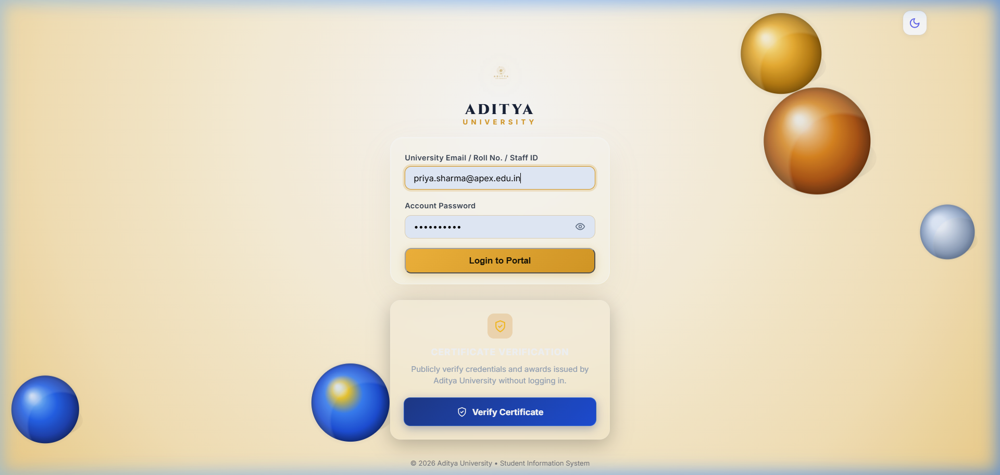
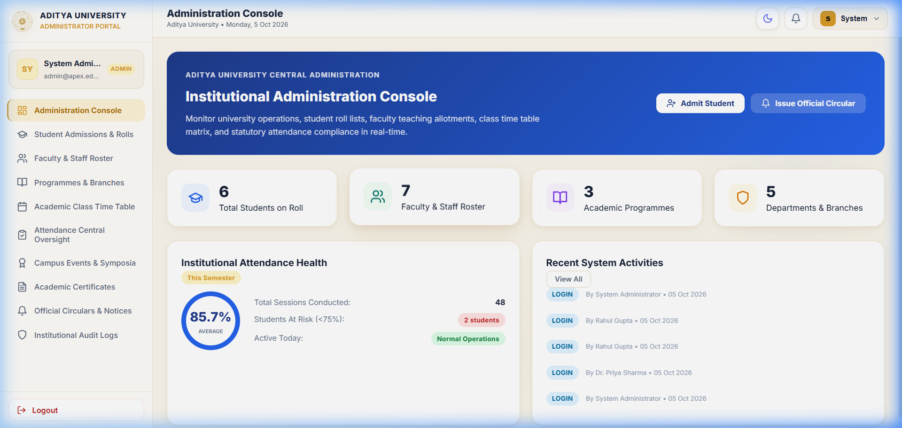
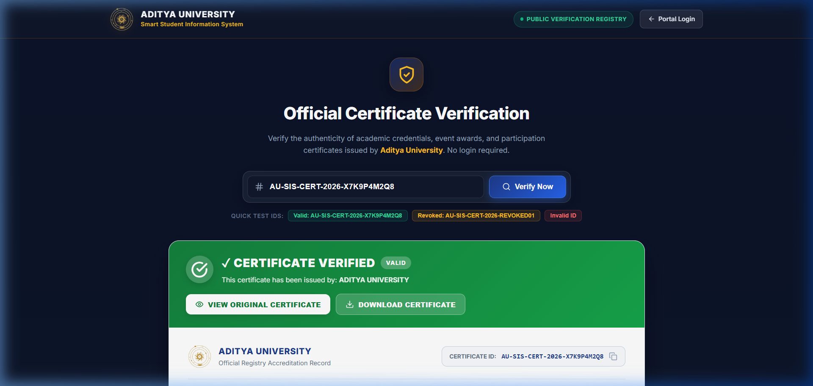

# 🎓 Smart Student Information System

### A Web-Based Student and Academic Information Management Platform

<p align="center">
  
  
  
  
  
</p>

---

## 📋 Table of Contents

1. [Project Overview](#1-project-overview)
2. [Project Objectives](#2-project-objectives)
3. [Key Features](#3-key-features)
4. [User Roles](#4-user-roles)
5. [System Modules](#5-system-modules)
6. [System Architecture](#6-system-architecture)
7. [Application Workflow](#7-application-workflow)
8. [Attendance Management](#8-attendance-management)
9. [Event Management](#9-event-management)
10. [Certificate Management](#10-certificate-management)
11. [Certificate Verification](#11-certificate-verification)
12. [Notification Management](#12-notification-management)
13. [Reports](#13-reports)
14. [Security](#14-security)
15. [Technology Stack](#15-technology-stack)
16. [Project Structure](#16-project-structure)
17. [Database](#17-database)
18. [Installation and Setup](#18-installation-and-setup)
19. [Frontend Setup](#19-frontend-setup)
20. [Backend Setup](#20-backend-setup)
21. [Screenshots](#21-screenshots)
22. [Team Members](#22-team-members)
23. [Project Author](#23-project-author)
24. [Academic Information](#24-academic-information)
25. [GitHub Repository](#25-github-repository)
26. [Future Enhancements](#26-future-enhancements)
27. [Project Status](#27-project-status)
28. [Acknowledgement](#28-acknowledgement)

---

## 1. Project Overview

The **Smart Student Information System (SIS)** is a comprehensive web-based academic management platform designed to centralise and organise student, faculty, and academic information across university departments. Developed for **Aditya University**, the platform eliminates fragmented data silos and manual record-keeping by providing a unified, secure, and accessible portal for institutional administration.

The system incorporates structured **Role-Based Access Control (RBAC)** to deliver distinct workspaces for three primary user groups:
- **Admin**: Oversees university-wide operations, master records, faculty and student registrations, departmental programs, curricula, event permissions, certificate templates, and administrative reports.
- **Faculty**: Manages assigned teaching allocations, daily course attendance sessions, internal assessments, semester grading, student rosters, and coordinated collegiate events.
- **Student**: Accesses personal academic profiles, subject-wise attendance logs, semester mark sheets, timetable schedules, university event registrations, and authentic verifiable digital certificates.

The platform spans key administrative and academic operations, including:
- **Student Management**: End-to-end student profiling, enrollment, and branch allocation.
- **Faculty Management**: Faculty designation, department assignments, and teaching responsibilities.
- **Academic Management**: Department hierarchies, course curricula, and syllabus configurations.
- **Attendance**: Session tracking, shortage monitoring, and percentage calculations.
- **Marks and Grades**: Internal assessment recording, grade evaluation, and performance summaries.
- **Timetable**: Weekly academic timetables, period allocations, and room assignments.
- **Events**: University symposiums, workshops, technical competitions, and registration tracking.
- **Certificates**: Dynamic credential template issuance, tamper-evident digital generation, and PDF export.
- **Notifications**: Circular broadcasts, departmental notices, and real-time alerts.
- **Reports**: Statistical attendance, academic performance, and credential distribution records.
- **System Management**: System configuration parameters, audit logging, and account security.

---

## 2. Project Objectives

The core objectives of the Smart Student Information System include:

- **Centralise Student and Academic Information**: Maintain institutional records, profiles, and academic histories in a unified, reliable database.
- **Provide Structured Role-Based Access**: Enforce fine-grained access boundaries between administrative personnel, teaching staff, and enrolled students.
- **Simplify Attendance Management**: Streamline daily attendance recording for faculty and provide clear visibility into attendance percentages for students.
- **Manage Academic Records**: Maintain comprehensive records of course subjects, internal assessment scores, and semester grades.
- **Manage Timetable and Subjects**: Provide transparent, structured daily and weekly schedules for faculty and students.
- **Support Event Management**: Facilitate end-to-end event handling, from initial announcement and coordinator assignment to registration and winner recording.
- **Support Certificate Generation and Verification**: Automate digital credential issuance with unique identifiers and facilitate public verification without exposing sensitive student data.
- **Provide Notifications and Reports**: Ensure timely communication of academic announcements and provide administrative reports for institutional decision-making.
- **Improve Organisation of Institutional Information**: Standardise records across departments to reduce clerical overhead and paperwork.
- **Provide a Responsive and User-Friendly Web Interface**: Ensure cross-device usability and accessible interactions across desktop and mobile browsers.

---

## 3. Key Features

### 🔐 Authentication & Security
- **Stateless Authentication**: JSON Web Tokens (JWT) for secure, stateless API session handling.
- **Password Protection**: BCrypt cryptographic hashing for all stored credentials.
- **Role-Based Access Control (RBAC)**: Enforced endpoint-level authorization for Admin, Faculty, and Student users.
- **Input Validation**: Server-side request validation using Jakarta Bean Validation.
- **Centralised Exception Handling**: Standardised REST error formats with informative messages and proper HTTP status codes.
- **Audit Logging**: Aspect-Oriented Programming (AOP) interceptors tracking critical administrative actions and system events.

### 🎓 Student Module
- **Profile**: View personal information, roll number, department, semester, and registered courses.
- **Attendance**: Real-time subject-wise and date-wise attendance records with shortage warnings (<75%).
- **Marks and Grades**: Semester grade reports, assessment marks, and cumulative academic performance.
- **Timetable**: View personalised daily class schedule and period information.
- **Events**: Explore upcoming university symposiums, workshops, and technical events with one-click registration.
- **Certificates**: View, preview, and download official PDF achievement and participation certificates.
- **Notifications**: Receive instant circulars, event updates, and attendance alerts.

### 👨‍🏫 Faculty Module
- **Profile**: Faculty teaching designations, contact details, and department allocations.
- **Classes**: View assigned courses, sections, and student rosters.
- **Attendance**: Initiate daily attendance sessions and record manual or session-based present/absent logs.
- **Marks and Grades**: Enter internal assessment and semester exam marks with automated grade computation.
- **Timetable**: View weekly teaching schedule and room allocations.
- **Events**: Manage assigned collegiate events, coordinate participants, and record event results.
- **Participants**: Review registered attendees and update event attendance statuses.
- **Certificates**: Authorise and generate official digital certificates for event winners and participants.

### 🛠️ Admin Module
- **Users**: Central user directory with account status controls and password management.
- **Students**: Manage student admissions, enrollments, roll numbers, and academic records.
- **Faculty**: Faculty onboarding, department assignments, and academic responsibilities.
- **Departments**: Configure university departments (AIML, CSE, ECE, EEE, MECH).
- **Courses**: Manage degree programs, curricula, and course offerings.
- **Subjects**: Semester-wise subject configurations and faculty subject mappings.
- **Attendance**: Institution-wide attendance monitoring and attendance shortage reports.
- **Timetable**: Master timetable matrix management and room scheduling.
- **Events**: Event creation, venue specification, and faculty coordinator assignment.
- **Certificates**: Certificate template designer, versioning, credential issuance, and revocation controls.
- **Notifications**: Campus-wide broadcasts and departmental circulars.
- **Reports**: Comprehensive analytics covering attendance, grades, and event participation.
- **Settings**: Institutional parameters, branding information, and configuration management.
- **Activity Logs**: System-wide administrative audit trail and action monitoring.

---

## 4. User Roles

| Role | Responsibilities |
|---|---|
| **Admin** | Institution-level system and academic management, user administration, departments, courses, certificate templates, and institution-wide reports. |
| **Faculty** | Assigned academic teaching, attendance recording, marks and grade entry, and authorised event and certificate coordination. |
| **Student** | Personal academic information access, attendance monitoring, marks review, timetable viewing, event registration, and certificate downloads. |

---

## 5. System Modules

| Module | Description |
|---|---|
| **Authentication** | User authentication, JWT issuance, password security, and role verification |
| **User Management** | Account provisioning, role assignments, profile management, and status toggling |
| **Student Management** | Student admissions, roll number assignments, and academic profiles |
| **Faculty Management** | Faculty profiles, designations, and departmental allocations |
| **Academic Management** | Department configurations, degree programs, and course curricula |
| **Attendance Management** | Daily attendance recording, session tracking, percentages, and shortage alerts |
| **Marks & Grades** | Internal assessments, semester examination marks, and grade calculations |
| **Timetable** | Weekly schedule matrices mapping courses, periods, faculty, and classrooms |
| **Event Management** | Event creation, faculty coordinator assignments, and participant tracking |
| **Certificate Management** | Template publishing, unique credential generation, PDF rendering, and revocation |
| **Certificate Verification** | Public read-only verification portal validating certificate authenticity |
| **Notifications** | Broadcast circulars, departmental updates, and academic notifications |
| **Reports** | Institutional analytics covering attendance, academic performance, and event participation |
| **System Management** | Application configuration, institution branding, and security audit logs |

---

<a id="6-system-architecture"></a>
## 6. 🏗️ System Architecture

The Smart Student Information System follows a layered architecture that separates the presentation, application, business logic, data access and database layers. The architecture supports role-based access for Admin, Faculty and Student users and provides dedicated flows for attendance, events, certificates, notifications and reports.

<p align="center">
  
</p>


### Architecture Layers

- **Presentation Layer** — Built with React and Vite, delivering a responsive user interface with dedicated portals for Admin, Faculty, Student, and Public verification.
- **Application/API Layer** — Powered by Spring Boot REST Controllers, handling incoming requests, payload validation, and HTTP routing.
- **Security Layer** — Implements stateless JWT authentication, BCrypt password hashing, Spring Security filters, and fine-grained Role-Based Access Control (RBAC).
- **Service Layer** — Encapsulates business logic, workflow rules, certificate generation, attendance calculations, and transactional operations.
- **Data Access Layer** — Leverages Spring Data JPA and Hibernate ORM for entity-relational mapping and database communication.
- **Database Layer** — Relational storage powered by MySQL for data integrity, ACID compliance, and structured indexing.

---

## 7. Application Workflow

```text
User
  ↓
Login
  ↓
Authentication
  ↓
Role Verification
  ↓
Role-Based Dashboard
  ↓
React Frontend
  ↓
REST API
  ↓
Spring Boot
  ↓
Service Layer
  ↓
Spring Data JPA
  ↓
MySQL Database
```

---

## 8. Attendance Management

Attendance tracking is a critical academic operation within the institution. The attendance hierarchy follows a structured path from university departmental allocations down to individual student records:

```text
Department
   → Programme
      → Academic Year
         → Year / Semester
            → Section
               → Subject
                  → Faculty
                     → Students
                        → Attendance Session
                           → Attendance Records
```

### Supported Attendance Statuses
- **PRESENT**: Student attended the scheduled class session.
- **ABSENT**: Student was absent without prior approved leave.
- **LATE**: Student arrived after the scheduled session cutoff.
- **EXCUSED**: Student was absent with valid institutional or medical leave.

### Roles & Responsibilities
- **Faculty**: Responsible for initiating class attendance sessions, marking roster statuses, submitting manual records, and reviewing student attendance correction requests.
- **Students**: Responsible for monitoring their subject-wise attendance percentage to ensure compliance with the university's 75% minimum requirement, submitting attendance correction queries where eligible, and tracking shortage alerts.

---

## 9. Event Management

The event management module provides an organised lifecycle for university symposia, hackathons, seminars, and technical competitions:

```text
Admin
  → Create Event
     → Publish Event
        → Assign Faculty Coordinator
           → Participant Registration
              → Participant Management
                 → Event Results
                    → Certificate Generation
```

### Event Lifecycle Stages
1. **Event Creation**: Admin defines event title, description, department, date, time, venue, and registration eligibility.
2. **Publication**: The event is published to the university portal for student discovery.
3. **Faculty Assignment**: A qualified faculty member is assigned as the event coordinator.
4. **Registration**: Students view event details and register with one-click enrollment.
5. **Participant Management**: The coordinator reviews registered students and logs attendance on event day.
6. **Results & Evaluation**: Coordinator enters competition outcomes (Winner, Runner-up, Participant).
7. **Certificate Generation**: Digital certificates are generated and issued to qualifying students.

---

## 10. Certificate Management

The certificate management module provides an authentic, verifiable digital credential pipeline for university events and achievements:

```text
Event
  → Participants
     → Results
        → Certificate Type
           → Published Template
              → Unique Certificate ID
                 → Certificate Generation
                    → Student Certificate
                       → Download / View
                          → Public Verification
```

### Supported Certificate Types
- **Winner**: Awarded to first-place event achievers.
- **Runner-up**: Awarded to second-place and commended performers.
- **Participation**: Issued to all validated event attendees.
- **Achievement**: Conferred for academic and technical milestones.
- **Special Recognition**: Conferred for distinguished contributions and leadership.

Every certificate is assigned a unique alphanumeric credential identifier (e.g., `SIS-EVT-2026-00001`), linking student achievements directly to the university's central verification registry.

---

## 11. Certificate Verification

The system provides a public, read-only certificate verification portal designed to allow employers, academic institutions, and students to validate credentials without requiring login credentials.

```text
Certificate ID
      ↓
Public Verification
      ↓
Database Lookup
      ↓
VALID / INVALID / REVOKED
```

### Verification States
- **VALID**: The certificate is authentic, verified by university records, and currently active. Displays recipient name, event, certificate type, issue date, and university accreditation.
- **INVALID**: The certificate ID does not exist in university records or was incorrectly entered.
- **REVOKED**: The certificate was officially revoked by university authorities due to administrative correction or eligibility changes.

> **Privacy & Security Note**: The public verification view strictly limits output to academic credential verification details and never exposes private user credentials, contact information, internal database identifiers, or sensitive student records.

---

## 12. Notification Management

The notification subsystem delivers prompt, role-filtered communications across five operational areas:

- **Attendance**: Immediate alerts when attendance falls below institutional thresholds (<75%) and class session announcements.
- **Events**: Notifications regarding newly published university competitions, schedule changes, and registration confirmations.
- **Certificates**: Alerts notifying students when certificates have been approved, generated, and made available for download.
- **Marks**: Notifications when semester examination marks or internal assessment scores are released.
- **System Updates**: Administrative circulars, policy notifications, and platform maintenance bulletins.

---

## 13. Reports

The system provides structured reporting capabilities for academic evaluation and administrative monitoring:

- **Attendance Reports**: Class-wise, subject-wise, and student-wise attendance percentages, as well as institutional shortage reports.
- **Marks / Academic Reports**: Performance summaries, semester score distribution, and grade card summaries.
- **Event Reports**: Participation metrics, departmental engagement figures, and event outcome logs.
- **Certificate Reports**: Credential distribution records, template issuance counts, and audit logs of revoked certificates.

---

## 14. Security

Security is integrated across every tier of the application architecture:

- **JWT Authentication**: Secure, stateless user sessions validated through signed bearer tokens.
- **BCrypt Password Hashing**: Industry-standard cryptographic salted hashing for stored user passwords.
- **Role-Based Access Control (RBAC)**: Enforced endpoint-level authorization matching user privileges (`ADMIN`, `FACULTY`, `STUDENT`).
- **Protected REST APIs**: Spring Security filter chains validate headers and permissions before invoking service logic.
- **Request Validation**: Incoming payloads undergo rigorous schema and field validation using Jakarta Bean Validation annotations.
- **Global Exception Handling**: Centralised `@RestControllerAdvice` prevents internal stack trace exposure and provides uniform error responses.
- **AOP / Audit Logging**: Aspect-Oriented Programming logs sensitive administrative operations and security events.
- **Backend Authorization**: Multi-layered authorization ensuring users can only read and mutate authorized domain entities.
- **Secure Database Access**: Parameterised queries via Spring Data JPA and Hibernate prevent SQL injection vulnerabilities.

---

## 15. Technology Stack

| Layer | Technology |
|---|---|
| **Frontend** | React + Vite |
| **Programming** | JavaScript (ES6+) |
| **Backend** | Java 17 + Spring Boot 3 |
| **API** | RESTful API |
| **ORM** | Hibernate |
| **Data Access** | Spring Data JPA |
| **Database** | MySQL 8 |
| **Authentication** | JSON Web Tokens (JWT) |
| **Password Security** | BCrypt |
| **Version Control** | Git + GitHub |
| **API Testing** | Postman |
| **Development** | VS Code / IntelliJ IDEA |

---

## 16. Project Structure

```text
Student-Information-Management/
│
├── backend/
│   ├── src/
│   │   ├── main/
│   │   │   ├── java/com/sms/
│   │   │   │   ├── aop/
│   │   │   │   ├── config/
│   │   │   │   ├── controller/
│   │   │   │   ├── dto/
│   │   │   │   ├── entity/
│   │   │   │   ├── exception/
│   │   │   │   ├── repository/
│   │   │   │   ├── security/
│   │   │   │   └── service/
│   │   │   └── resources/
│   │   │       └── application.properties
│   │   └── test/
│   ├── pom.xml
│   ├── .env.example
│   └── Dockerfile
│
├── frontend/
│   ├── public/
│   │   ├── aditya-crest.png
│   │   ├── aditya-logo.png
│   │   └── favicon.ico
│   ├── src/
│   │   ├── assets/
│   │   ├── components/
│   │   ├── context/
│   │   ├── pages/
│   │   ├── services/
│   │   │   └── api.js
│   │   └── utils/
│   │       └── certificateGenerator.js
│   ├── package.json
│   ├── vite.config.js
│   ├── .env.example
│   └── Dockerfile
│
├── docs/
│   ├── architecture/
│   │   └── system-architecture.png
│   └── screenshots/
│       ├── login.png
│       ├── admin-dashboard.png
│       ├── faculty-dashboard.png
│       ├── student-dashboard.png
│       ├── attendance.png
│       ├── events.png
│       ├── certificates.png
│       └── my-certificates.png
│
├── docker-compose.yml
├── .env.example
├── .gitignore
└── README.md
```

---

## 17. Database

The system utilizes **MySQL** as its relational database management system to guarantee persistent storage, data integrity, and ACID transactional guarantees.

- **Database Name**: `student_information_system`
- **Schema Management**: Managed via Hibernate / JPA object-relational mapping.

### Example Database Configuration
```properties
spring.datasource.url=jdbc:mysql://localhost:3306/student_information_system?useSSL=false&serverTimezone=Asia/Kolkata&allowPublicKeyRetrieval=true&createDatabaseIfNotExist=true
spring.datasource.username=root
spring.datasource.password=YOUR_MYSQL_PASSWORD
spring.jpa.hibernate.ddl-auto=update
```

---

## 18. Installation and Setup

### Prerequisites
- **Git** (version 2.30 or higher)
- **Node.js** (version 18 or higher) and **npm**
- **Java Development Kit (JDK)** (version 17 or higher)
- **MySQL Server** (version 8.0 or higher)

### Cloning the Repository
```bash
git clone https://github.com/anjiduda77-afk/Student-Information-Management.git
cd Student-Information-Management
```

---

## 19. Frontend Setup

1. **Navigate to the frontend directory**:
   ```bash
   cd frontend
   ```

2. **Install dependencies**:
   ```bash
   npm install
   ```

3. **Configure environment variables**:
   Create a `.env` file in the `frontend/` directory (refer to `.env.example`):
   ```env
   VITE_API_BASE_URL=http://localhost:8080
   VITE_APP_URL=http://localhost:5173
   ```

4. **Start the development server**:
   ```bash
   npm run dev
   ```
   The frontend application will be accessible at `http://localhost:5173` (or the port specified by Vite).

---

## 20. Backend Setup

1. **Navigate to the backend directory**:
   ```bash
   cd backend
   ```

2. **Create the MySQL Database**:
   Log into your MySQL command-line or GUI client and create the database:
   ```sql
   CREATE DATABASE student_information_system;
   ```

3. **Configure application properties**:
   Edit `src/main/resources/application.properties` (or set environment variables):
   ```properties
   spring.datasource.url=jdbc:mysql://localhost:3306/student_information_system?useSSL=false&serverTimezone=Asia/Kolkata&allowPublicKeyRetrieval=true&createDatabaseIfNotExist=true
   spring.datasource.username=root
   spring.datasource.password=YOUR_MYSQL_PASSWORD
   app.base-url=http://localhost:8080
   app.frontend-url=http://localhost:5173
   ```

4. **Build and run the Spring Boot application**:
   - On Windows (PowerShell / Command Prompt):
     ```bash
     .\mvnw spring-boot:run
     ```
   - On Linux / macOS:
     ```bash
     ./mvnw spring-boot:run
     ```
   The backend API will be available at `http://localhost:8080`.

---

## 21. Screenshots

The following section contains visual walkthroughs of the key interfaces in the Smart Student Information System:

### Login Interface


### Admin Management Dashboard


### Faculty Portal Dashboard


### Student Portal Dashboard


### Attendance Management System


### Event Coordination & Registrations


### Digital Certificate Management


### Student Certificate Locker


---

## 22. Team Members

| S.No | Name | Roll Number | Role |
|---:|---|---|---|
| 1 | DUDA ANJIBABU | 24B11AI093 | Project Developer |
| 2 | [TEAM MEMBER NAME] | [ROLL NUMBER] | [ROLE] |
| 3 | [TEAM MEMBER NAME] | [ROLL NUMBER] | [ROLE] |
| 4 | [TEAM MEMBER NAME] | [ROLL NUMBER] | [ROLE] |

---

## 23. Project Author

### **DUDA ANJIBABU**
- **Programme**: B.Tech — Artificial Intelligence & Machine Learning
- **Institution**: Aditya University — Surampallem, Andhra Pradesh
- **Roll Number**: 24B11AI093
- **GitHub Profile**: [https://github.com/anjiduda77-afk](https://github.com/anjiduda77-afk)

---

## 24. Academic Information

| Field | Details |
|---|---|
| **Project Title** | Smart Student Information System |
| **Student Name** | DUDA ANJIBABU |
| **Roll Number** | 24B11AI093 |
| **Programme** | B.Tech — Artificial Intelligence & Machine Learning |
| **College** | Aditya University |
| **Location** | Surampallem, Andhra Pradesh |
| **Project Type** | Academic Project |

---

## 25. GitHub Repository

- **Repository URL**: [https://github.com/anjiduda77-afk/Student-Information-Management.git](https://github.com/anjiduda77-afk/Student-Information-Management.git)
- **Maintainer Profile**: [https://github.com/anjiduda77-afk](https://github.com/anjiduda77-afk)

---

## 26. Future Enhancements

Potential future improvements identified for subsequent phases of development include:

- **Mobile Application**: Developing a companion mobile application for iOS and Android platforms.
- **Additional Institutional Integrations**: Integrating with campus learning management systems (LMS) and library management systems.
- **Enhanced Reporting**: Incorporating graphical predictive attendance trends and comparative department analytics.
- **Advanced Dashboard Customisation**: Enabling widget personalization and custom notification feeds for students and faculty.
- **Additional Notification Channels**: Incorporating automated SMS and email digest channels for attendance shortage alerts.
- **Expanded Academic Workflows**: Supporting digital elective subject registration and student feedback collection.

---

## 27. Project Status

**Academic Project — Under Development / Enhancement**

The core architectural modules, role-based dashboards, attendance tracking, marks management, event handling, digital certificate generation, and public verification systems are implemented and functional for academic project evaluation.

---

## 28. Acknowledgement

I express my sincere gratitude to **Aditya University — Surampallem, Andhra Pradesh**, the Department of Artificial Intelligence & Machine Learning, faculty mentors, and academic advisors for their continuous guidance, technical encouragement, and institutional support throughout the development of the **Smart Student Information System**.

---
<p align="center">
  <strong>Smart Student Information System</strong> • Aditya University • Surampallem, Andhra Pradesh
</p>
